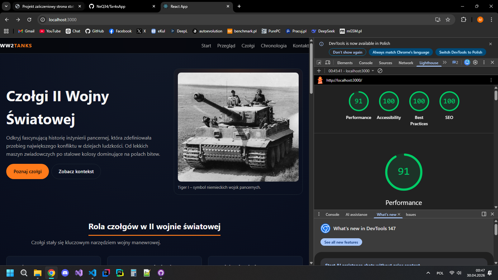

# Czołgi II Wojny Światowej – projekt zaliczeniowy

Strona internetowa prezentująca najważniejsze czołgi II wojny światowej. Projekt wykonany w React.

---

## Analiza UX

### Potrzeba użytkownika
Użytkownicy (uczniowie, pasjonaci historii, gracze) potrzebują szybkiego i przejrzystego przeglądu czołgów II wojny światowej, bez rozproszonych, przegadanych artykułów.

### Grupa docelowa
- Uczniowie szkół podstawowych i średnich – wiedza do nauki/prezentacji
- Pasjonaci historii wojskowości – szybkie przypomnienie kluczowych danych
- Gracze gier wojennych – realne odpowiedniki czołgów z gry

### Struktura strony
Strona prowadzi użytkownika w logicznej kolejności: najpierw wprowadzenie (co to za strona), potem kontekst (dlaczego czołgi były ważne), dalej konkretne czołgi, później oś czasu, a na końcu kontakt. Dzięki temu użytkownik nie gubi się i dostaje informacje we właściwej kolejności.

### Kolorystyka i układ
- **Ciemne gradientowe tło** – nawiązuje do wojennego klimatu, a jednocześnie jasny tekst dobrze się na nim czyta.
- **Pomarańczowy akcent** – wyróżnia przyciski i najważniejsze elementy, dzięki czemu użytkownik od razu widzi, gdzie kliknąć.
- **Karty i siatki** – informacje są podzielone na małe, czytelne bloki, co ułatwia szybkie przyswojenie treści i nie przytłacza użytkownika.
- **Responsywność** – na komputerze czołgi są wyświetlane w trzech kolumnach, co pozwala łatwo je porównać. Na telefonie układ zmienia się w jedną kolumnę, wygodną do przewijania palcem.

---

## Dokumentacja techniczna

### Struktura folderów

- ww2-tanks/
  - public/
    - index.html
  - src/
    - assets/
      - obrazy (tiger.webp, t34.webp, sherman.webp, tiger1.webp)
    - components/
      - Header.jsx
      - Hero.jsx
      - Overview.jsx
      - Tanks.jsx
      - Timeline.jsx
      - Resources.jsx
      - Footer.jsx
    - App.js
    - App.css
    - index.js
  - package.json
  - README.md

### Główne komponenty

| Komponent | Rola |
|-----------|---------|
| `Header` | Sticky nawigacja, logo, menu hamburger na mobile |
| `Hero` | Sekcja powitalna, tytuł, przyciski |
| `Overview` | Trzy karty – rola czołgów w wojnie |
| `Tanks` | Galeria 3 czołgów |
| `Timeline` | Oś czasu|
| `Resources` | Formularz kontaktowy |
| `Footer` | Stopka i link "Powrót na górę" |

### Przygotowanie pod backend

**Formularz** – dodać wysyłkę POST do `/api/contact`

### Uruchomienie projektu:

npm install   
npm start     

### Google Lighthouse

### Figma
link: https://www.figma.com/design/cvvhi77V2IWJyb13ixa73T/Untitled?node-id=0-1&t=p9oQoLHrv0p2zpZc-1

### Autor
Mateusz Ćwirta